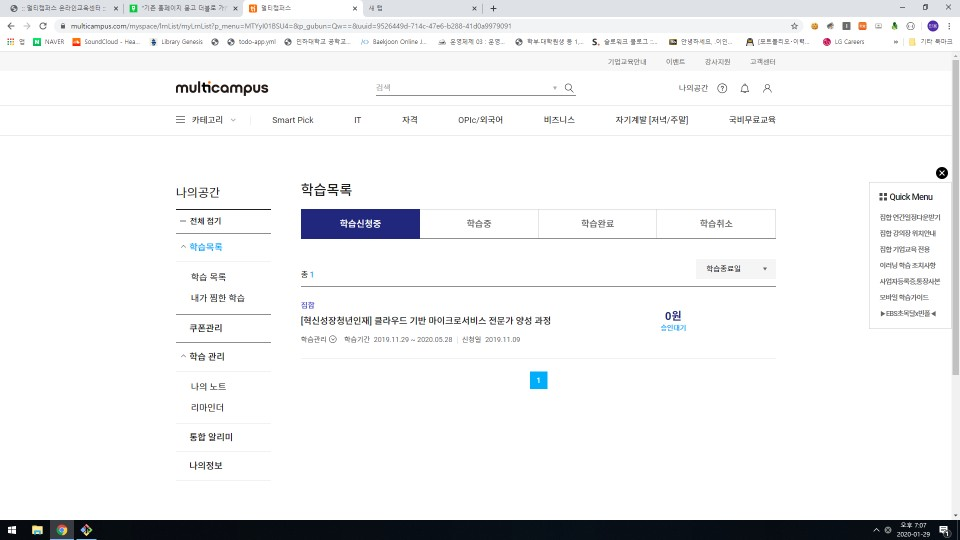
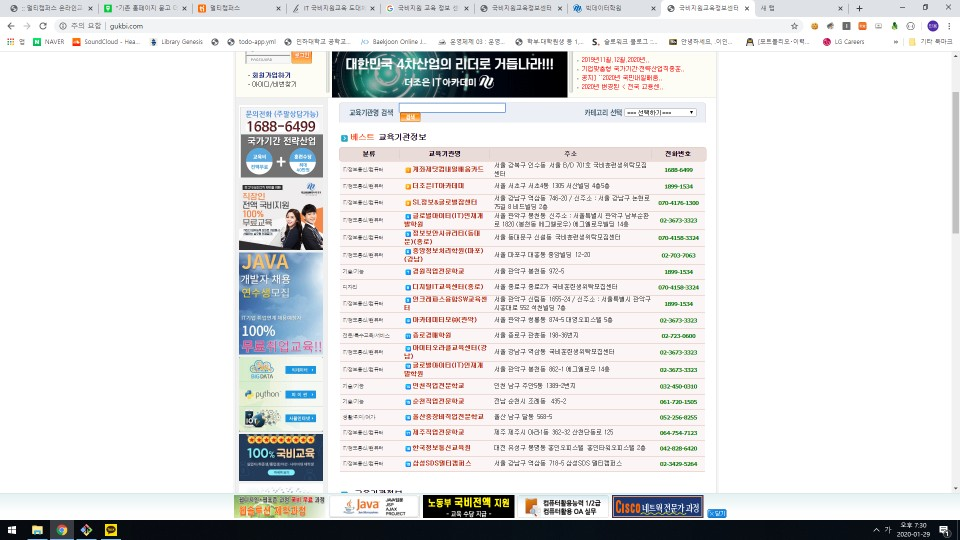

# 필요한 이유
### 관리자로서 필요한 이유
- 공지할 일이 있을 때마다 직접 공지하거나 전파해야한다
- 일정이나 계획을 쉽고 안전하게 관리할 수 있다.
- 성적이나 출결과 같은 학생 자료를 쉽고 안전하게 관리할 수 있다.
- 팀관리를 쉽게 할 수 있다.
- 주제별로 세부적인 공지를 할 수 있다.
- 쉽게 시험을 준비할 수 있다.
### 교사(강사)로서 필요한 이유
- 자신이 교육한 것을 쉽게 확인할 수 있다.
	- 포트폴리오가 될 수 있다.
- 다른 강사들이 어떻게 교육을 진행했는지 공유할 수 있다.
- 팀 프로젝트의 진행상황을 쉽고 자세하게 볼 수 있다.
- 통합된 환경에서 수강생과 자료를 나눠줄 수 있다.
	- 자료를 나눠주기 위해 다른 서비스를 따로 선택하지 않아도 된다.
		- 다른 서비스 예시: GitHub, 구글드라이브, ppt, 팀관리, 
- 직접 만날 일이 없는 다른 반의 수강생과도 커뮤니케이션도 할 수 있다.
### 학생으로서 필요한 이유
- 자신의 학업성취도를 쉽게 확인할 수 있다.
- 
- 전체적으로 소통할 수 있다.
- 강사나 관리자에게 궁금한 부분을 언제나 쉽게 물어볼 수 있다.
- 수강현황을 쉽게 확인할 수 있다.
- 팀프로젝트를 관리, 공유하기 위해 다른 서비스를 따로 선택하지 않아도 된다.
	- 다른 서비스 예시: 슬랙, 트렐로, 구글드라이브, 카카오톡

## 싸피가 이용중인 서비스 5가지
- 오픈톡방 카톡
- 깃랩 서버
- 출결관리 겸, 커뮤니티
- 싸피 정식 홈페이지
	- 시험 
- 취업상담사이트

# 멀티캠퍼스  사이트

- 멀티캠퍼스 사이트는 개강한지 2달동안 아직도 학습 신청중이다. => 사이트 이용 전혀 안함
- 과정중에 특별한 사이트를 사용하지 않는다. => 강사님들이 각자 깃이나 웹쉐어 사용

- 국비지원 교육 정보센터 사이트 : 국비지원 교육 하는 학원들을 홍보해주는 사이트
- => 전체 학원 2898곳  => 인기많은곳은 대부분 IT 학원 
- => 이곳에 쌍용, 비트교육센터, 멀티캠퍼스 같이 대형 IT 학원들은 있지도 않다.

# 부경대학교 LMS

## 1. 메인 기능

- 달력을 통한 일정 관리

- 공지사항

- 강의 신청

- 출결관리

- 과목 검색

- 학사일정

  

## 2. 커뮤니티 기능

- 공지사항
- 질의응답
- 자료실
- 소모임
- 설문

# 순천향대학교 LMS

## 1. 교수지원

- 공지사항
- 교수소개

## 2. 학습지원

- 경진대회
- 멘토링

## 3. 이러닝 지원

- 프로그램 참여

## 4. 이용안내

- 공지사항
- 질의답변

# 동신대학교 LMS

- 입학지원
- 질의응답
- 교육비 납입 조회

# 대구대학교 LMS

- 개설과목 검색
- 학사일정
- 질의 응답
- 자료실
- 설문
- 학교소개

#  운정 앤써 학원

- 학생 성적관리
- 출석 관리

- 공지사항

# 청취닷컴

- 출결관리
- 포인트 제도

- 성적관리

