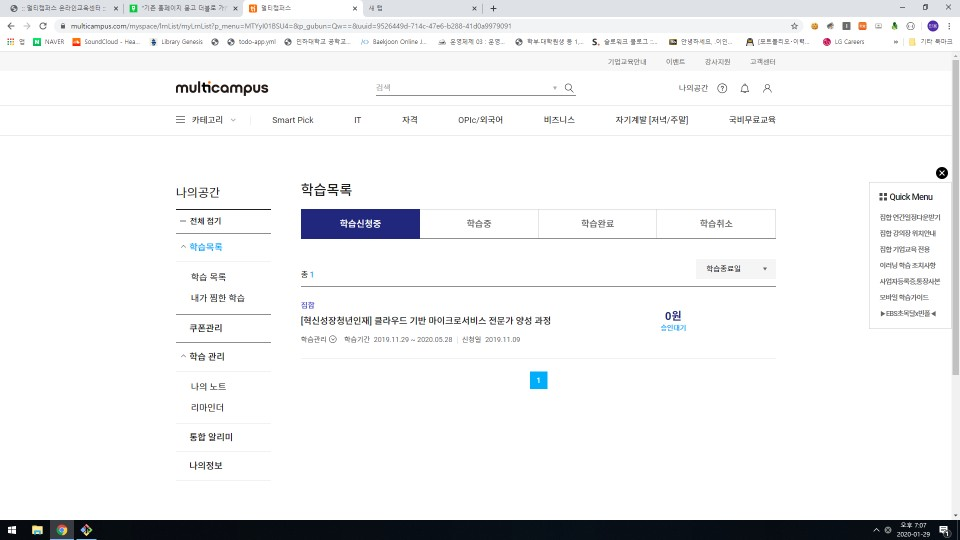
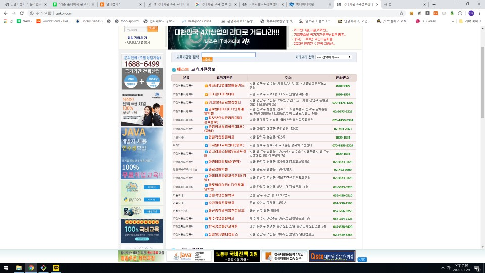

# 멀티캠퍼스  사이트

- 멀티캠퍼스 사이트는 개강한지 2달동안 아직도 학습 신청중이다. => 사이트 이용 전혀 안함
- 과정중에 특별한 사이트를 사용하지 않는다. => 강사님들이 각자 깃이나 웹쉐어 사용

- 국비지원 교육 정보센터 사이트 : 국비지원 교육 하는 학원들을 홍보해주는 사이트
- => 전체 학원 2898곳  => 인기많은곳은 대부분 IT 학원 
- => 이곳에 쌍용, 비트교육센터, 멀티캠퍼스 같이 대형 IT 학원들은 있지도 않다.

